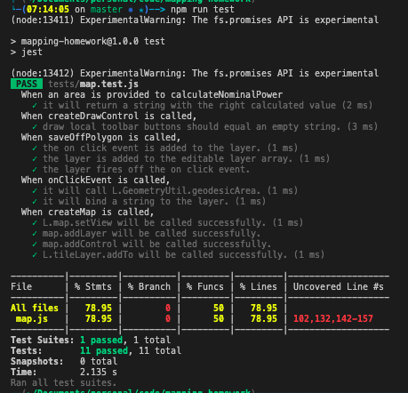

# Mapping Example

The purpose of this example is to do the following.

- Design a website that showcases a map using 3rd party providers
- Draw a polygon onto the map in any arbitrary area
- Calculate the nominal power of the drawn polygon

## Delivery

- App must be simple, intuitive and smooth user experience
- README file with how to configure and run
- Show approach through version control history

## Rules

- App must be compatible with modern broswers and mobile devices
- Allowed to use 3rd party libraries, APIs and code fragments, with citations
- Include minimal test suite for the application
- Justify decisions, assumptions and usage of 3rd party services or
- Comment code

## Bonus Optional Features

- Search for an address in the United States
- Enter tilt and orientation angles for the surface under the polygon and calculate the area of the polygon's projection on that plane.
- Connnect to a servie to estimate annual electricity production for the system.

## Overall design direction

I went ahead selected Sapper/Svelte for the creation of the website. A few reasons to go with this approach is ease of setting up the overall [project](https://sapper.svelte.dev/docs/). This allowed me to not focus on creating the webserver but the code and features.

Main.js, App.svelte, package.json, rollup.config.js are all created by cloning the default svelte project.

## How to run and test

You are able to run this locally by running the following commands

- `export HOST=0.0.0.0` // Allows access from your local computer to any mobile device connected to same network.
- `export PORT=80` // Can change this to any port you desire
- `npm install`
- `npm run dev`
    - Running dev allows live reloading of the app. You can find the url to open in the terminal but it's normally `localhost:80/`. You will also see the Network option for access from mobile.

You are able to run all avilable test by running the following command.

- `npm run test`

## How to use app

In the topleft corner of the application, you will see a few buttons to interact with the app. The main one to create a new polygon, you will need to click the middle of 5 buttons.

You will create the polygon by selecting different points on the map.

Once you created the polygon, you will see a tooltip popup whenever you click the polygon.

This will show you the area and nominal power for the created polygon

All measurements are measured in feet.

You can edit the polygons by click the 4th button and selecting already created nodes or selecting new ones.

You can also delete polygons by selecting the 5th button and selecting any polygon on the map. It will not truely remove them until you select save.

## Assumptions used through the code

- All solar panels used in this exercise will be 5.42 ft x 3.25 ft (17.60 sq ft) solar panel that is rated 250Wp.
- All polygons(regardless of actual shape) will be able to hold the calculated number of panels based on the above figure.

## References used

- Creating the map using [Leaflet.js](https://leafletjs.com/reference-1.7.1.html#map-factory).
- Adding a draw component to the map that only draws [polygons](https://leaflet.github.io/Leaflet.draw/docs/leaflet-draw-latest.html).
- Formula used to calculate [nominal power](https://myelectrical.com/notes/entryid/225/photovoltaic-pv-electrical-calculations).